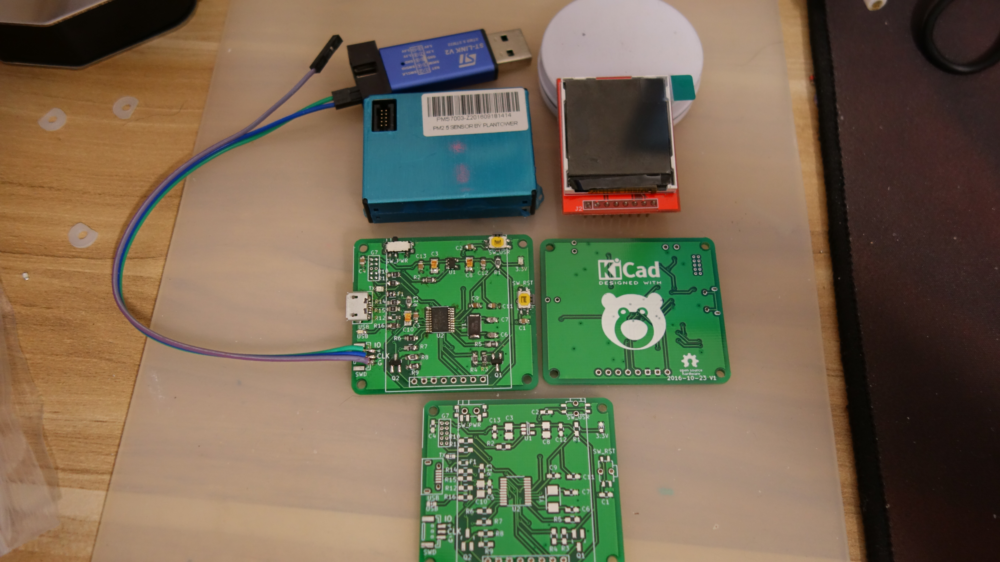

# pmtoy-hardware-pcb
空气质量检测模块，主控 STM32F070F6 ，主传感器采用攀藤科技 PMS7003 ，带有 1.4寸 TFT显示 和 USB传输

## 硬件部分

+ 主控 STM32F070F6
+ UART, PMS7003 传感器
+ SPI, 1.4寸 TFT 显示
+ 开关，3.3V 电源转换
+ 按钮，芯片RESET 
+ 按钮，编程
+ LED， 编程
+ USB， 供电 + 通讯
+ SWD 接口

## 已知问题

+ 传感器模块接口插孔太小，导致接口无法完整插入，焊锡连接的情况下，不影响使用。
+ 接上传感器模块后，3.3V 供电无法开关切换，原因: 传感模块 5V 电源没有考虑开关
+ USB DP 1.5k 上拉电阻没有必要，芯片内部已经实现了，故独立使用LED功能.

## 实物照片

